footer: Emanuele Della Valle - http://emanueledellavalle.org
slidenumbers: true

#        Streaming Data Analytics       

### **Emanuele Della Valle**
#### prof @ Politecnico di Milano  Co-founder @ Quantia Consulting  [emanuele.dellavalle@polimi.it](mailto:emanuele.dellavalle@polimi.it) [http://emanueledellavalle.org](http://emanueledellavalle.org)

---

# The vision
## Continuity matters!

---

---

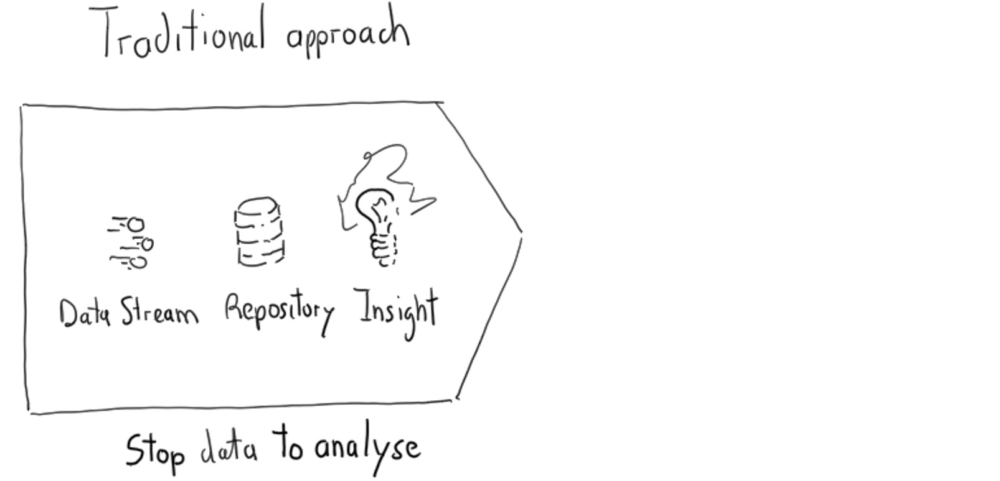

---

---

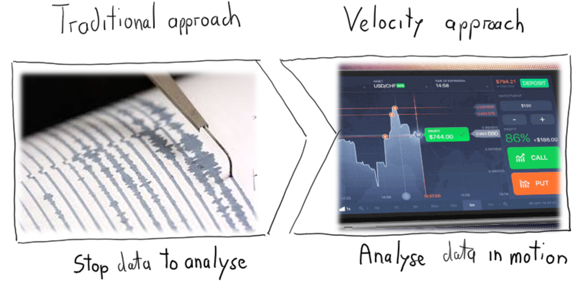

---

# The key ingredients

---

# The key ingredients

1. Sensor and actuators
2. Connectivity
3. Streaming Data Engineering
4. Streaming Data Science
5. People & Processes

---

# The key ingredients

1. **Sensor and actuators** (*as sources and sinks, not covered in the course*)
2. Connectivity
3. Streaming Data Engineering
4. Streaming Data Science
5. People & Processes

---
## Sensors
# Eyes using cameras

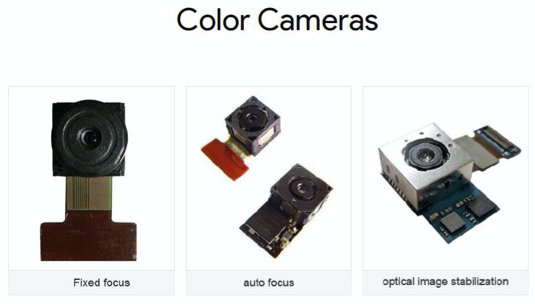 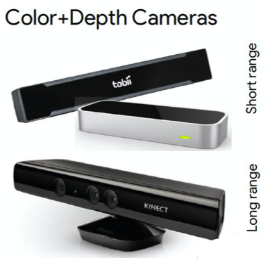 

---
## Actuators
# Lights to display 

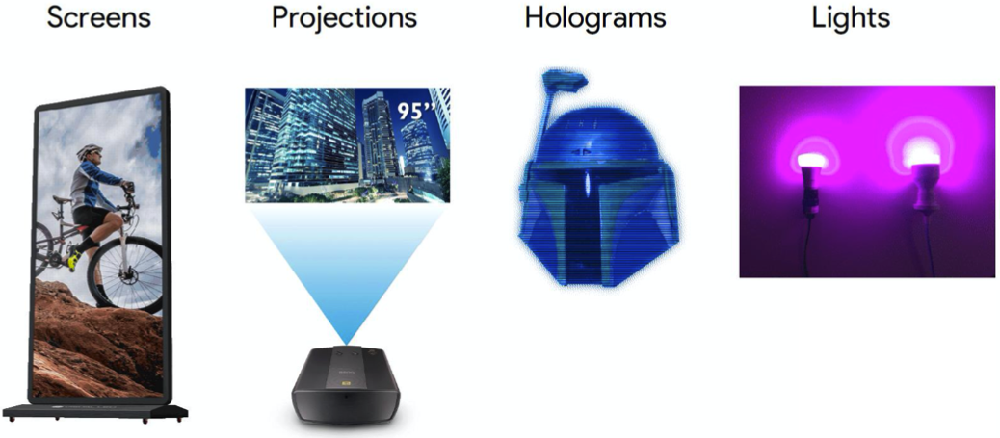

---

## Sensors
# Ears using microphones

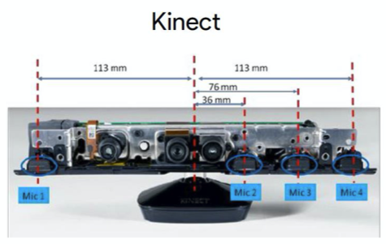 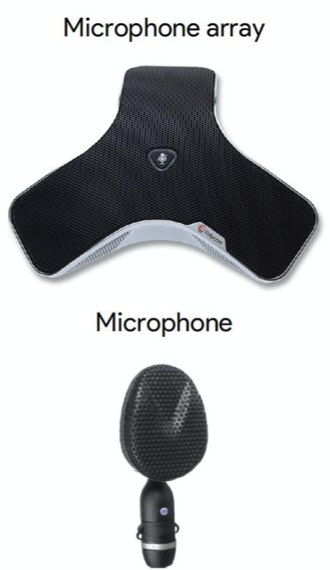 

---
## Actuators
# Speakers to speak 

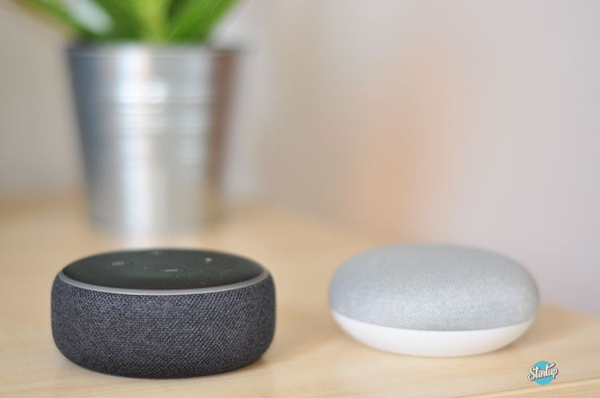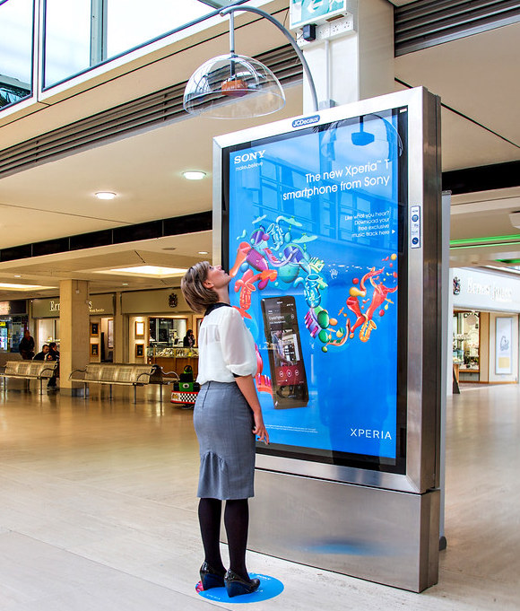

---

## Sensors
# Skin to feel touches

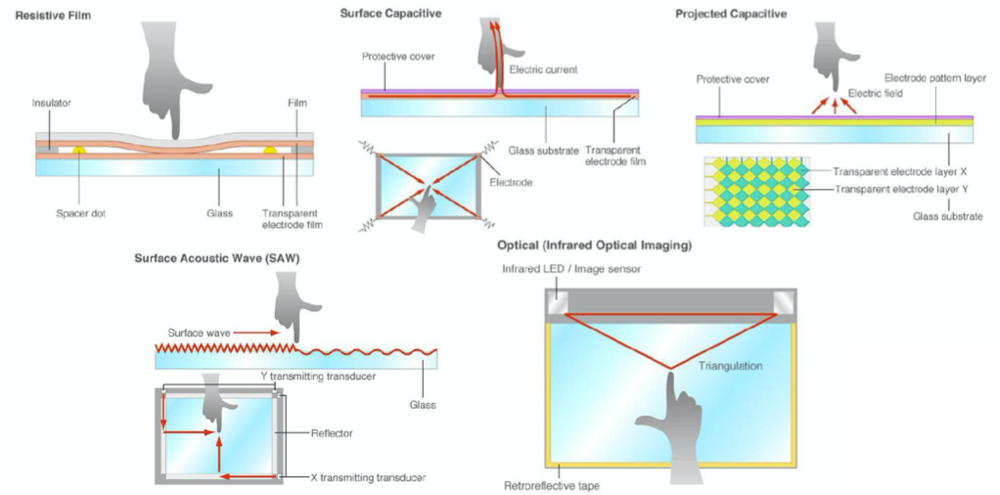

---

## Actuators
# Ultrasounds to generate tactile sensations 

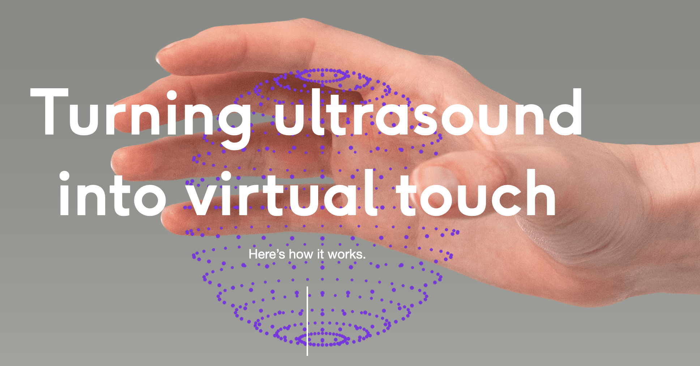

---

## Sensors and actuators
# ... and more!!!

* A **digital nervous system** 

	* Orienteering capabilities using **GPS**, **compass**, ...
	* Sensory organs that can measure **temperature**, **pressure**, ...

* ... and an increasing number of **actuators**

	* **harms** and **hands**
	* a **locomotor system**
	* ...

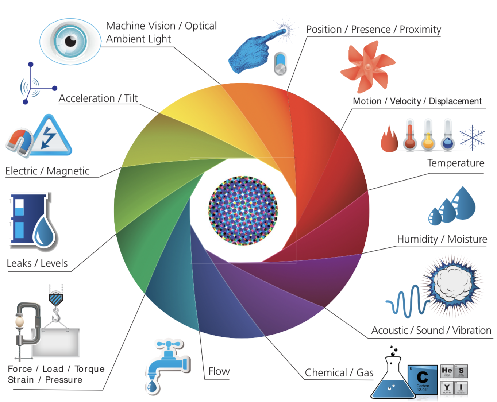 

---

# The key ingredients

1. Sensor and actuators
2. **Connectivity** (*as enabling and constraining factor, not covered in the course*)
3. Streaming Data Engineering
4. Streaming Data Science
5. People & Processes

---

# Connectivity

To transport sensory observations and actuation signals

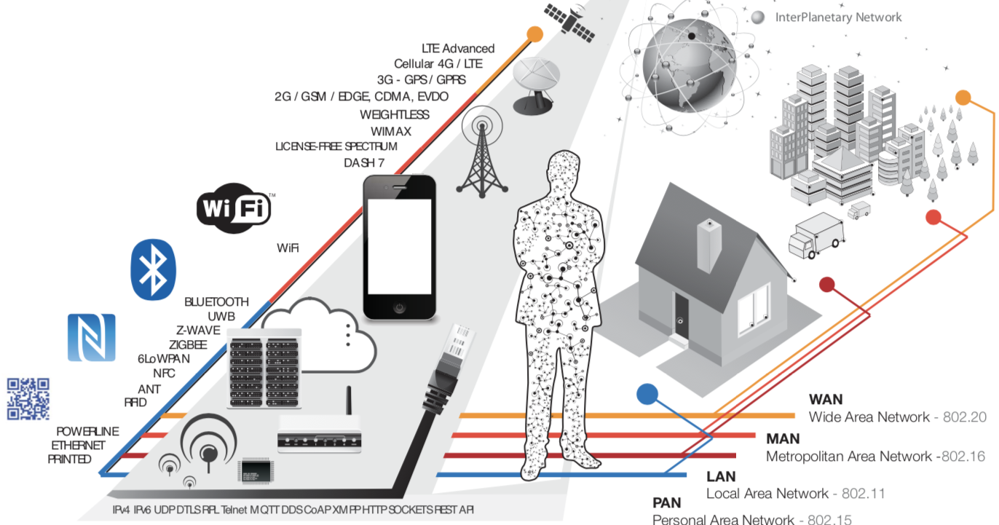 

---

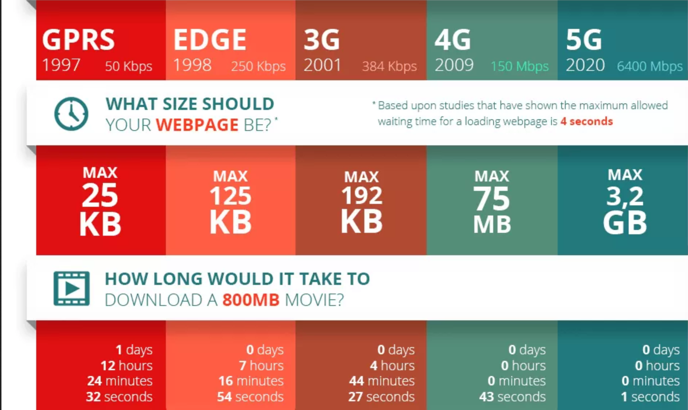 

---

# The key ingredients

1. Sensor and actuators
2. Connectivity
3. **Streaming Data Engineering** (*core topic of the course*)
4. Streaming Data Science
5. People & Processes

---

 

---

 

---

# The key ingredients

1. Sensor and actuators
2. Connectivity
3. Streaming Data Engineering
4. **Streaming Data Science** (*core topic of the course*)
5. People & Processes

---

 

---

 

---

# The key ingredients

1. Sensor and actuators
2. Connectivity
3. Streaming Data Engineering
4. Streaming Data Science
5. **People & Processes** (*to stress real-world applicability*)

---

# People & processes 
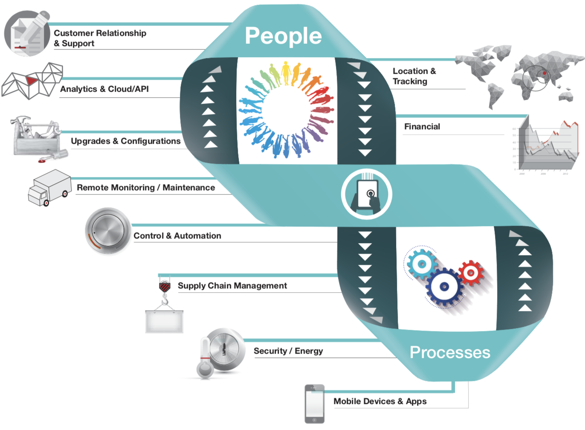 

---

# Case studies 

---

# Learning Thermostats

Save resources and money on your heating bills by adapting to your usage patterns and turning the temperature down when you’re away from home.

E.g., [Nest](https://store.google.com/us/product/nest_learning_thermostat_3rd_gen?hl=en-US)

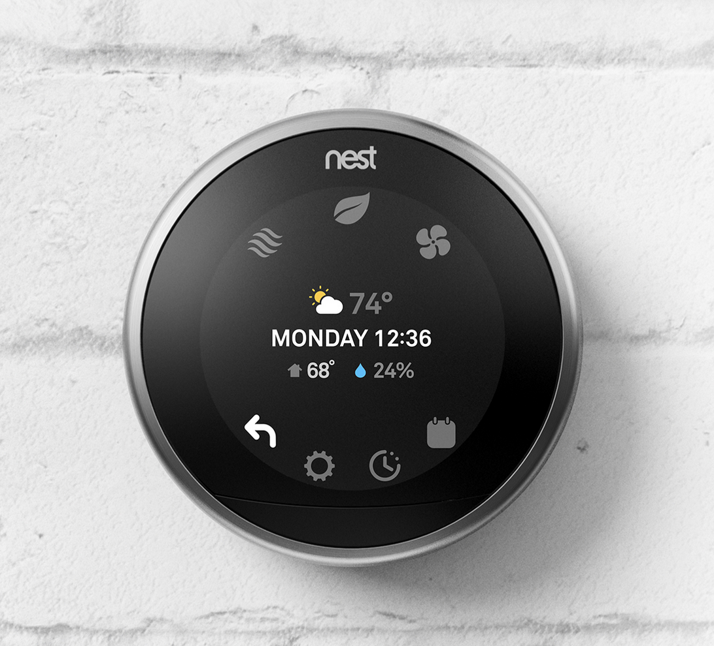

---

# Self-driving cars

From Google Car research to Tesla autopilot and Vitibot

E.g., [A movie I assembled](https://youtu.be/CTzKLpU3kto )

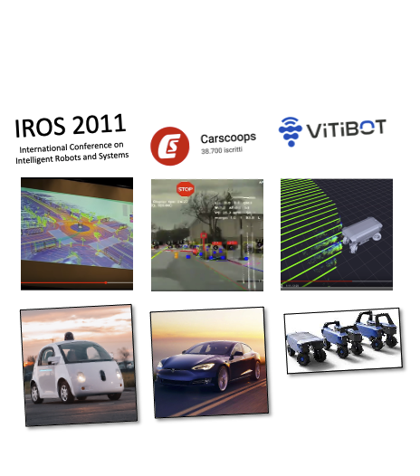 

---

# Smart connected industrial products

The data collected from these products are analyzed to inform decision-making, enable operational efficiencies and continuously improve the product's performance. 

E.g., [thyssenkrupp's Max elevator](https://www.thyssenkrupp-elevator.com/en/max/)

---

# Equipment as a service 

Pioneered in 1997 by Rolls-Royce, which lets airlines pay for their engines based on the number of flight hours. It is now a standard business model in many industrial settings.

E.g., [Heller's insurance for its machines](https://www.heller.biz/en/services/insurances/)

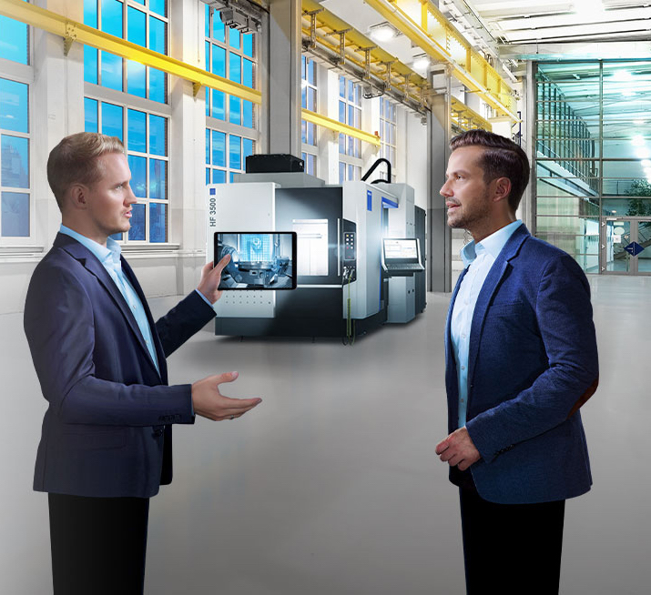

---

# Smart logistics

They are employing innovative technology to increase efficiency, effectiveness, and security by making logistics more environmentally sustainable, economically efficient, and capable of handling increasing traffic. 

E.g., [Hamburg Port Authority's Smart Port](https://www.hamburg-port-authority.de/en/hpa-360/smartport/)

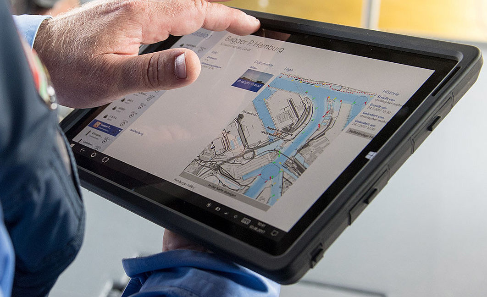

---
## The ultimate goal
# Better decision making

---
# Better decision making

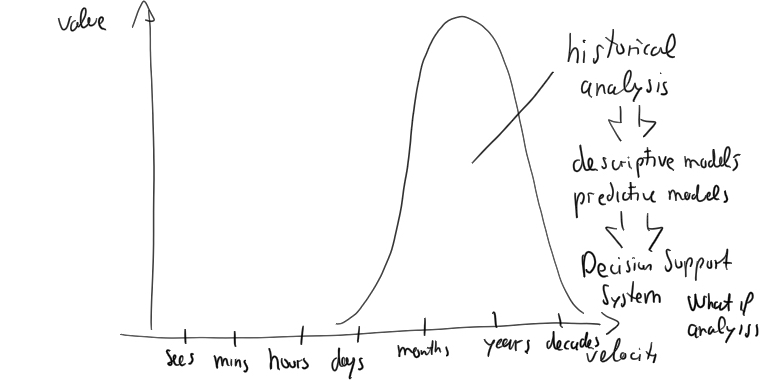

---

# Better decision making

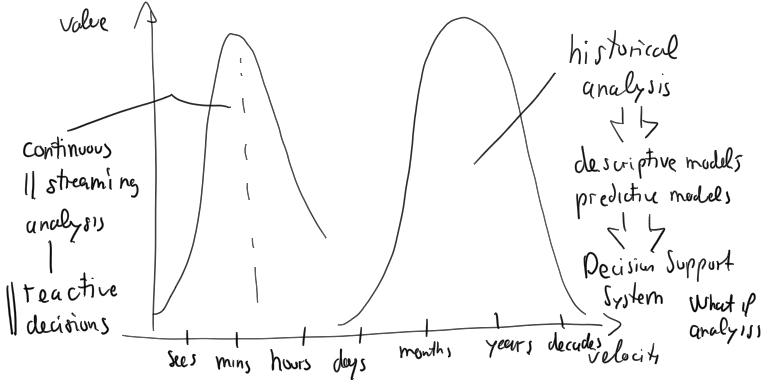

---

# Better decision making

E.g.:

* reduce costs
* improve efficiency
* create innovative products
* new revenue streams

---

# Streaming Data Analysis Maturity Model

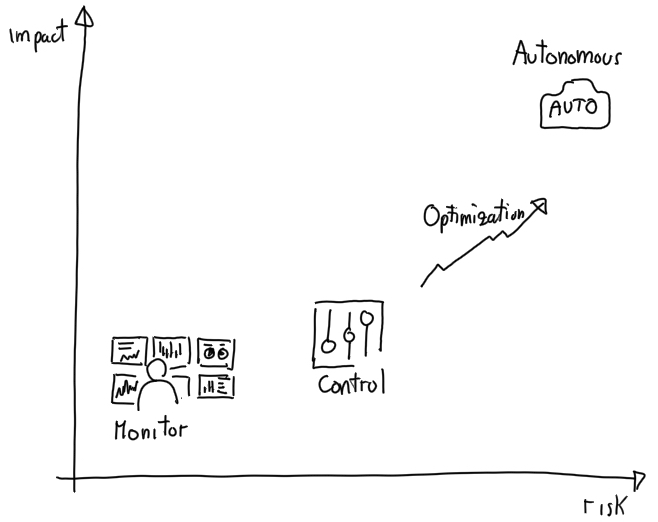

---

# Conclusions

---

# It's about time

* **Continuous ingestion**
	* Events instead of tables of data
	* Publish / Subscribe middlewares instead of blob storage solutions
* **Continuous data preparation**
	* Stream- and Event-first data management
	* Continuous processing, no blocking operations
	* Incremental algorithms are a must
* **Reactive answers**
	* minimize latency while keeping high throughput
	* stream of answers

---

# It's about change and temporal dependencies

* **The identically distributed assumption does not hold**
	* Traditional ML hardly applies  
	* Change detection plays a key role
	* Streaming Machine Learning is a must
* **The data independence assumption does not hold** 
	* Traditional ML hardly applies 
	* Time Series Analytics is a must

---

# It's at scale

* Trillions of concurrent messages 
* Billions of sensors/actuators
* Often disconnected 
`________________________________________`
* Whenever possible 
  * **stay decentralized**
  * **do it incrementally** 
  * **minimize resource footprint**
  * **do it at the edge**
* Bring data together only if merging provides a real benefit

---

#        Streaming Data Analytics       

### **Emanuele Della Valle**
#### prof @ Politecnico di Milano  Co-founder @ Quantia Consulting  [emanuele.dellavalle@polimi.it](mailto:emanuele.dellavalle@polimi.it) [http://emanueledellavalle.org](http://emanueledellavalle.org)
